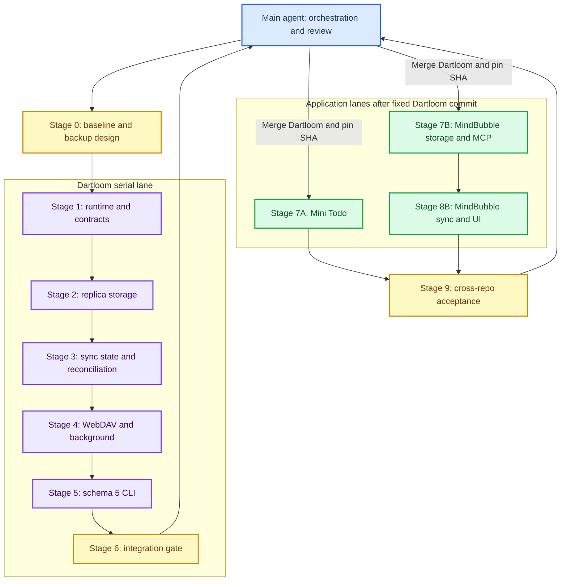

# Dartloom、Mini Todo 与 MindBubble 多仓库重构执行计划

_供新会话主 agent 与阶段子 agent 使用；基线采集于 2026-08-14。目标是先完成 Dartloom schema 5，再并发迁移两个应用。_

---

## 📋 文档用途与固定决策

这是一份可执行的多 agent 交接协议。新会话主 agent 必须先完整阅读本文，再读取三个仓库的实时状态。每个实现阶段交给新的子 agent 以隔离上下文；主 agent 只负责编排、审查、验证 gate、协调提交与合并，以及处理跨阶段决策。

> ⚠️ **基线可能变化：** 本文中的 commit 与脏工作区是 2026-08-14 快照。任何 agent 开工前必须重新运行只读检查，不能假设 HEAD 或工作树未变化。

| 主题 | 已确认决策 |
| --- | --- |
| 总顺序 | 先重构 Dartloom；其 `main` 稳定后并发迁移 Mini Todo 与 MindBubble |
| Dartloom 范围 | 一次性处理已识别的全部结构问题，不只增加文件存储 |
| API 兼容 | Dartloom 仍为 `0.x`，允许破坏性删除、重命名和语义调整 |
| 配置版本 | 升级为 `schema_version: 5`，CLI 自动迁移 schema 4 |
| 业务路径 | 应用通过 custom factory 传入绝对路径；Dartloom 不拥有业务目录 |
| 同步基础 | 原始字节/文件是 replica 基础；JSON 是业务编码和适配实现 |
| 动作判定 | 只有通过授权 API 的增、改、删才是同步 intent |
| 外部修改/删除 | 不算 intent；有远端基线时由远端恢复本地 |
| 外部新文件 | 不上传、不删除、不进入 MindBubble 正常列表；显式导入后才成为 intent |
| MindBubble MCP | 属于授权动作，必须写入与应用相同的 intent log |
| MindBubble 远端 | 新路径 `/MindBubble/bubbles/`；旧 `/MindBubble/v2/bubbles/` 只补充缺失对象 |
| MindBubble 冲突 | Dartloom 管生命周期、ETag、状态和冲突；应用注入 Markdown 字段级 merge policy |
| Mini Todo 数据 | 保持现有 JSON 独立记录和本地目录 |
| Git 交付 | 功能分支通过后合并本地 `main`，再次验证，再推送功能分支和 `main` |
| 数据安全 | 应用迁移前创建不可覆盖、带 manifest/hash 的本地备份；远端旧数据不删除 |

## 🏗️ 仓库、基线与分支

### 绝对路径

| 仓库 | 本地路径 | 远端 |
| --- | --- | --- |
| Dartloom | `D:\FantasyProjects\dartloom` | `https://github.com/wkzMagician/dartloom.git` |
| Mini Todo | `D:\FantasyProjects\mini_todo` | `https://github.com/wkzMagician/mini-todo.git` |
| MindBubble | `D:\FantasyProjects\MindBubble` | `git@github.com:wkzMagician/MindBubble.git` |

### 采集时状态

| 仓库 | HEAD | 工作树 |
| --- | --- | --- |
| Dartloom | `8a84287b01ec8dabf92603caaf31e9f8c08a3789` | `main` 干净，与 `origin/main` 对齐 |
| Mini Todo | `304defdbf78357a3c972652f36de21a0ccd0a861` | `main`，用户修改了 `README.md`，不得覆盖 |
| MindBubble | `898d63a35adfdba3285330d009f4ffa7a4952ee9` | `main`，有上一轮 Dartloom 接入、格式化改动及未跟踪 `installer/`，不得 reset |

MindBubble 已有归档：

```text
tag:    archive/mindbubble-0.4.0+5
branch: archive/mindbubble-0.4.0
```

目标功能分支：

```text
Dartloom:   codex/replica-file-storage
Mini Todo:  codex/dartloom-schema-5
MindBubble: codex/dartloom-schema-5
```

禁止直接在 `main` 开发。若分支已存在，先检查来源与提交，不得强制重建。

## 🧭 Agent 编排与交接协议



### 主 agent 职责

1. 每阶段前读取 `git status --short --branch`、`git log -3 --oneline` 和前一阶段交接文件
2. 给新的子 agent 一份只包含该阶段所需信息的任务说明，并指向本文
3. 检查子 agent 的 diff、提交、测试证据、遗留问题和越界改动
4. 独立运行 gate 验证命令，不只相信子 agent 报告
5. 通过 gate 后记录 commit SHA，再启动下一阶段
6. contract 决策写入仓库文档，禁止只存在聊天上下文

### 子 agent 通用约束

- 只修改阶段声明的仓库和文件范围
- 开工前读取仓库内 `AGENTS.md`、`dartloom.yaml`、相关 README 和测试
- 使用 `rg` 定位引用，不凭类型名猜测影响范围
- 保留已有用户修改，不使用 `git reset --hard` 或 `git checkout --`
- 先补测试，再实现和更新文档
- 生成代码通过 CLI 生成，不手工长期维护
- 阶段结束形成内聚提交，不夹带无关格式化
- 未通过测试不得声称完成
- 除非任务明确授权，不合并 `main`、不推送

### 标准交接摘要

```text
阶段：
仓库与分支：
起始 SHA：
结束 SHA：
修改的 contract/API：
持久化 schema 变化：
迁移/回滚行为：
关键文件：
新增或修改的测试：
验证命令与结果：
未解决风险：
下一阶段必须知道的事项：
```

## 📁 Dartloom 代码地图

```text
D:\FantasyProjects\dartloom\
├── cli\dartloom_cli\                 # CLI、配置、迁移、代码生成
├── packages\dartloom_runtime\        # capability registry 和生命周期
├── packages\dartloom_settings\       # SettingsStore contract
├── packages\dartloom_storage\        # 当前 Text/JSON/Database/ReplicaJsonStore
├── packages\dartloom_storage_json_file\
├── packages\dartloom_storage_text_file\
├── packages\dartloom_sync\           # replica、policy、coordinator
├── packages\dartloom_sync_storage\   # local replica、profile/state repository
├── packages\dartloom_sync_etag\      # ETag reconciler
├── packages\dartloom_sync_webdav\    # WebDAV remote replica
├── packages\dartloom_sync_flutter\   # 生命周期/网络 signal
├── packages\dartloom_sync_workmanager\
├── dartloom_integration\              # 集成应用
├── template\flutter_app\             # 新应用模板
├── bricks\                            # capability 模板
├── melos.yaml
└── README.md
```

| 领域 | 必须阅读的文件 |
| --- | --- |
| Runtime | `packages/dartloom_runtime/lib/dartloom_runtime.dart` |
| Storage contract | `packages/dartloom_storage/lib/dartloom_storage.dart` |
| JSON 目录 | `packages/dartloom_storage_json_file/lib/dartloom_storage_json_file.dart` |
| 文本文件 | `packages/dartloom_storage_text_file/lib/dartloom_storage_text_file.dart` |
| Sync/coordinator | `packages/dartloom_sync/lib/dartloom_sync.dart` |
| Local replica/state | `packages/dartloom_sync_storage/lib/dartloom_sync_storage.dart` |
| ETag | `packages/dartloom_sync_etag/lib/dartloom_sync_etag.dart` |
| WebDAV | `packages/dartloom_sync_webdav/lib/dartloom_sync_webdav.dart` |
| Background | `packages/dartloom_sync_workmanager/lib/dartloom_sync_workmanager.dart` |
| Registry | `cli/dartloom_cli/lib/src/capabilities/capability_registry.dart` |
| Config | `cli/dartloom_cli/lib/src/config/config_loader.dart`、`dartloom_config.dart`、`option_schema.dart` |
| Upgrade | `cli/dartloom_cli/lib/src/commands/upgrade_command.dart` |
| Generator | `cli/dartloom_cli/lib/src/templates/managed_templates.dart` |
| Integration | `dartloom_integration/dartloom.yaml` 与 `lib/capabilities/capabilities.dart` |

## ✍️ 阶段 0：基线、归档与备份设计

### 子 agent 任务

对三个仓库进行只读审计，并在 Dartloom 功能分支补充安全设计文档。此阶段不得重构 contract。

### 工作范围与产物

- 在 `D:\FantasyProjects\dartloom` 创建或切换到 `codex/replica-file-storage`
- 记录 Mini Todo 和 MindBubble 状态，但不整理其工作树
- 新建 `D:\FantasyProjects\dartloom\docs\schema-5\baseline.md`
- 新建 `D:\FantasyProjects\dartloom\docs\schema-5\decisions.md`
- 记录所有 Dartloom package 版本、依赖关系和公开 API 清单
- 设计不可覆盖的备份 manifest；实际应用数据备份留到对应应用迁移阶段执行

### 路径发现规则

不能把“通常路径”当作真实路径。应用迁移 agent 必须调用应用使用的 `path_provider` API 解析：

```text
MindBubble 业务数据：getApplicationDocumentsDirectory()/MindBubble/bubbles
MindBubble 技术状态：getApplicationSupportDirectory()/MindBubble
Mini Todo 数据：JsonDirectoryStore(path: MiniTodo) 当前解析出的 application support 路径
```

备份 manifest 至少记录：绝对来源路径、绝对备份路径、UTC 时间、应用版本、相对文件路径、大小和 SHA-256。备份目录存在时创建唯一时间戳目录，不能覆盖。

### Gate 0

- Dartloom 分支基于最新 `origin/main`
- 三仓库 tracked/untracked 状态和用户改动已记录
- 三仓库原有 diff 未变化
- 备份设计覆盖缺失目录、权限失败和部分复制失败
- 阶段提交只包含文档/安全基线

## ✍️ 阶段 1：Runtime、Settings 与基础 contract

### 子 agent 任务

重构 Dartloom runtime 和基础 contract，为后续 storage/sync 提供稳定底座。本阶段不实现文件同步。

### 目标设计

- 新增实例化 `DartloomRuntime`
- 保留 `Dartloom` 默认 facade，但内部委托默认 runtime
- 支持隔离初始化、逆序 dispose、失败清理和 dispose 后重用
- capability registration 增加 `foreground`、`background`、`both` 启动范围
- `SettingsStore` 保留简单标量 API；新增结构化 JSON settings contract 或明确 codec
- secret 继续由 secure storage 保存，不进入普通 settings、日志或生成源码
- 公开 API 命名在本阶段定稿并写入 `docs/schema-5/decisions.md`

### 允许修改

```text
packages/dartloom_runtime/**
packages/dartloom_settings/**
受影响 adapter package 的编译修复
CLI registration/startup scope 模型及测试
docs/schema-5/**
```

### 必测行为

- 两个 runtime 实例互不污染
- 循环依赖、缺失 factory 和返回类型错误
- 中途失败后逆序释放已创建 binding
- foreground/background registration 过滤
- 默认 facade 的 `get/maybeGet/contains/dispose`
- 结构化设置往返、未知字段和损坏数据处理

### Gate 1

- runtime/settings 相关 package analyze/test 通过
- CLI 仍可编译和运行既有测试
- 交接摘要列出所有删除/重命名的公开符号
- 不包含 storage/sync 行为改写

## ✍️ 阶段 2：通用 ReplicaStore 与文件目录实现

### 子 agent 任务

移除“同步必须是 JSON”的结构耦合，新增应用指定路径的通用文件 replica。

### Contract 要求

最终名称可由本阶段 agent 在决策文档中定稿，但必须具备以下能力：

```dart
abstract interface class ReplicaStore {
  String get identity;
  Stream<StoreChange> get changes;
  bool acceptsKey(String key);
  Future<List<ReplicaObjectMetadata>> scan();
  Future<Uint8List?> readBytes(String key);
  Future<void> writeBytes(
    String key,
    Uint8List data, {
    StoreMutationOrigin origin,
  });
  Future<void> delete(
    String key, {
    StoreMutationOrigin origin,
  });
  Future<Set<String>> explicitDeletedKeys();
  Future<void> forgetExplicitDelete(String key);
  Future<void> close();
}
```

结构原则：

- `ReplicaStore` 不继承 `JsonStore`
- 删除 `ReplicaJsonStore`；`JsonDirectoryStore` 可组合或分别实现 JSON CRUD 与 replica contract
- 新增 `packages/dartloom_storage_file`
- `FileDirectoryStore` 的 `root` 和 `metadataRoot` 必须由应用传入 `Directory` 或绝对路径
- Dartloom 不调用 `getApplicationSupportDirectory()` 决定业务数据目录
- metadata 必须位于业务目录之外
- `readReplicaBytes/writeReplicaBytes` 从 JSON 专属 contract 移到通用 replica contract
- `JsonStoreMutationOrigin`/`JsonStoreChange` 改为通用命名

### Intent 与 observed state

只有授权来源可以写 intent：

```text
application
migration
conflictResolution
```

`remote`、`recovery` 和普通文件扫描不产生上传 intent。扫描必须能报告：

```text
untrustedLocalChange
unexpectedMissing
unregisteredLocalObject
```

### 文件安全要求

- 拒绝空 key、绝对路径、`.`、`..` 和路径逃逸
- 禁止跟随越界 symlink/reparse point
- 原子替换，临时文件名称唯一
- 扫描排除临时文件和 metadata
- 启动时清理可确认的残留临时文件
- 并发写入采用串行化或文件锁
- intent/deletion journal 原子保存并跨重启恢复
- 整个业务 root 消失时重建空目录，但不生成批量 tombstone

### Gate 2

- UTF-8、非 UTF-8 和二进制字节往返测试通过
- 外部修改、外部删除和外部新建测试通过
- root 整体删除不会产生删除 intent
- JSON adapter 原有业务 CRUD 测试继续通过
- 新 package README 明确“路径由应用指定”

## ✍️ 阶段 3：强类型同步状态与 reconciler

### 子 agent 任务

重构 `dartloom_sync`、`dartloom_sync_storage` 和 `dartloom_sync_etag`，让 reconciler 消费通用 replica，并正确区分 observed state 与 intent。

### 强类型状态

用显式类型和 codec 替换核心逻辑中的散乱 `Map<String, Object?>`：

```text
SyncState
SyncRecord
StoredIntent
StoredConflict
StoredResolution
ReplicaScan
ReplicaObjectMetadata
SyncObject
```

持久化 state 独立版本化。损坏或未知版本进入安全失败，不能推导远端删除。

### Reconciliation 决策矩阵

| 本地 observed state | Intent | 远端 | 行为 |
| --- | --- | --- | --- |
| 缺失 | 无 | 存在 | 从远端恢复 |
| root 整体缺失 | 无 | 存在 | 重建并恢复 |
| 缺失 | 明确删除 | 基线未变 | 条件删除远端 |
| 内容变化 | 无 | 存在 | 远端恢复本地 |
| 内容变化 | 明确修改 | 基线未变 | 条件上传 |
| 新文件 | 无创建 intent | 不存在 | 不上传，报告未登记对象 |
| 新文件 | 明确创建 | 不存在 | 条件创建 |
| 本地和远端均修改 | 明确修改 | 已修改 | 调 merge policy；失败则冲突 |
| 本地明确删除 | 删除 intent | 远端已修改 | 删除与修改冲突 |

### API 整理

- 可统一 `LocalObject`/`RemoteObject`，但必须保留 content hash 与 ETag 的语义差异
- capabilities 改为可扩展集合，避免不断增加 bool
- 统一冲突 ID 为 `<profileId>::<key>`
- resolution 使用 `useLocal`、`useRemote`、`deleteBoth`、`useMerged`、`postpone`
- conflict payload 支持 inline、外部引用或 hash-only
- coordinator 只根据 intent 传播本地删除
- profile 切换不得删除共享本地目录

### Gate 3

- 完整决策矩阵有自动化测试
- 旧 JSON 同步测试迁移后通过
- 状态损坏、扫描不完整和异常缺失不会删除远端
- merge policy 得到 local/remote/base 原始字节
- 所有冲突路径使用相同 ID 格式

## ✍️ 阶段 4：WebDAV、后台调度与错误模型

### 子 agent 任务

完善任意字节 WebDAV backend、远端迁移和 background-only 初始化。

### WebDAV 要求

- 保留 `Uint8List` GET/PUT
- 创建使用 `If-None-Match: *`，更新/删除使用 `If-Match`
- 初始化阶段 probe 条件写入和 ETag 一致性
- 正规化弱/强 ETag，但不能把语义不同的 tag 判为相同
- 区分 authentication、permission、notFound、precondition、invalidResponse、connectivity、timeout、serverLimit
- partial scan 是显式结果；没有 cursor 时不能假装分页完成
- 达到 listing limit 时安全失败或继续分页，禁止静默遗漏
- legacy migration 支持完整旧相对路径到新 root 的只复制映射
- 并发 migrator 使用条件创建，幂等且不删除源

### Background 要求

- worker 只初始化 `background` 或 `both` capability
- 不初始化 localization、resident、window 等前台能力
- worker 超时或失败后释放 runtime、stream 和文件句柄
- 保留 Android Workmanager 行为；桌面不注册不支持的后台任务

### Gate 4

- fake WebDAV 覆盖 PROPFIND/GET/PUT/DELETE、缺失 ETag、412、401/403、429/5xx 和 partial listing
- background minimal bootstrap 测试通过
- legacy migration source 保持不变

## 阶段 5：schema 5、CLI 与生成器

### 子 agent 任务

让 CLI 能表达“应用拥有路径，Dartloom 只消费路径”的 schema 5，并自动、安全地迁移 schema 4。

### schema 5 目标形态

配置只描述能力、类型和工厂符号，不在 Dartloom 中放业务目录默认值。例如：

```yaml
schema_version: 5
app:
  id: mind_bubble
capabilities:
  storage:
    kind: app_file_replica
    factory: createBubbleReplicaStore
  sync:
    enabled: true
    backend: webdav
```

应用侧工厂负责解析并传入绝对路径：

```dart
ReplicaStore createBubbleReplicaStore(AppPaths paths) {
  return FileDirectoryStore(root: paths.bubblesDirectory.absolute);
}
```

最终名称可以在阶段 0 ADR 中调整，但配置语义不得退回框架自选目录。

### 迁移要求

- `dartloom upgrade` 识别 schema 4 的 `storage.json`、`sync.replica`、filters、seed、legacy remote 等字段
- 改写前创建不可覆盖备份；首选 `dartloom.yaml.v4.backup`，若存在则追加时间戳或递增编号
- 先写临时文件并重新解析、校验，再原子替换原配置
- `--dry-run` 输出结构化迁移报告且不修改任何文件
- 无法从旧配置确定绝对业务路径时，生成显式 TODO/诊断并失败，不猜测目录
- 二次运行必须幂等，不重复备份、不重复注册 capability
- 生成代码与用户代码明确分层；只改 Dartloom 所有的 generated 文件
- Git 依赖必须固定到已经通过 Gate 6 的 commit SHA，不允许长期引用浮动分支

### 重点目录

- `D:\FantasyProjects\dartloom\cli\dartloom_cli\lib\src\config\`
- `D:\FantasyProjects\dartloom\cli\dartloom_cli\lib\src\registry\`
- `D:\FantasyProjects\dartloom\cli\dartloom_cli\lib\src\templates\`
- `D:\FantasyProjects\dartloom\cli\dartloom_cli\lib\src\commands\`
- `D:\FantasyProjects\dartloom\cli\dartloom_cli\test\`
- `D:\FantasyProjects\dartloom\templates\`
- `D:\FantasyProjects\dartloom\bricks\`
- `D:\FantasyProjects\dartloom\integration_test\`

### Gate 5

- mini-todo 的 schema 4 fixture 可无损迁移到 schema 5
- custom file replica 示例生成后可 `dart analyze`、`dart test`
- dry-run 的文件 hash 前后相同
- migration 二次执行无额外变化
- 生成器不覆盖 ARB、widget、repository、MCP 或用户自定义工厂
- CLI、模板、README 和示例不再宣称 Dartloom 拥有应用业务目录

## 阶段 6：Dartloom 独立审计、合并与固定版本

该阶段必须交给没有实现阶段 1–5 的验证 agent。它只修复验证发现的局部问题；若发现架构缺口，退回对应阶段 agent，不在审计阶段重新设计。

### 验证方法

Dartloom 根目录没有根 `pubspec.yaml`，不能只执行一次根级 `dart test`。根据 `melos.yaml` 逐个覆盖 `cli/**` 和 `packages/**`：

1. `dart format --output=none --set-exit-if-changed`。
2. 每个 package 执行依赖解析、`dart analyze`、`dart test`。
3. 可发布 package 执行 publish dry-run。
4. 执行 CLI 单元测试、模板 golden、migration fixture 和 integration test。
5. 在临时目录生成一个 JSON 应用和一个 custom file replica 应用并编译测试。
6. 若仓库已有 Windows smoke test，则验证文件锁、原子替换和路径 Unicode。

### 交付与 Gate 6

- 推送 `codex/replica-file-storage`
- 合并到本地 `main`，在合并态重跑核心测试
- 推送远端 `main`
- 记录远端 `main` 的精确 SHA 为 `DARTLOOM_SCHEMA5_SHA`
- 确认远端 branch 和 main 均可见
- 只有完成以上步骤，阶段 7A 与 7B 才可并发启动

## 阶段 7A：mini-todo schema 5 适配

### 前置和边界

- 仓库：`D:\FantasyProjects\mini_todo`
- 分支：`codex/dartloom-schema-5`
- 基线：`304defd...`
- 已知用户改动：`README.md`，必须保留，不得清理或覆盖
- Dartloom 依赖固定到 `DARTLOOM_SCHEMA5_SHA`
- mini-todo 继续使用独立 JSON 文件，不改业务 UI 和交互

### 先读代码

- todo repository、controller 和 model
- home 页面及其同步状态展示
- `dartloom.yaml`
- generated capabilities 和 capability registry
- 现有同步测试、WebDAV 配置与升级测试

开始时用 `rg --files` 和 `rg "JsonDirectoryStore|schema_version|sync-metadata|MiniTodo|mini-todo"` 得到准确路径，禁止按文件名猜测。

### 数据契约

- 远端 root 保持 `MiniTodo`
- todo 对象键保持 `todo-<id>`
- 元数据对象保持 `.mini-todo.json`
- 同步 metadata namespace 保持 `mini_todo/sync-metadata/MiniTodo`
- 本地实际目录继续由现有 `JsonDirectoryStore` 路径解析；迁移前记录其解析后的绝对路径
- 旧 `MiniTodo/json` 如需迁移，只允许补齐目标缺失对象，源保持不变

### 实现步骤

1. 先做配置和本地数据不可变备份。
2. 用 Gate 6 的 CLI 执行 schema 5 migration，并审阅 diff。
3. repository 继续提供原业务 JSON API；通过 JSON codec/adapter 接到通用 `ReplicaStore`。
4. 应用内 create/update/delete 必须写入 intent journal；事务失败时业务写入与 intent 不得一半成功。
5. 外部修改和外部删除不产生 intent，下一次同步由远端恢复。
6. 外部新 JSON 文件只显示为 unregistered，不上传、不删除；必须显式 import 才成为应用对象并生成 create intent。
7. 保留页面功能、排序、编辑、完成状态、同步按钮、冲突处理和错误提示。
8. 删除旧同步实现前，用 `rg` 证明所有调用点已迁移且没有双重协调器。

### Gate 7A

- 原 repository 与 widget 测试全部通过
- schema migration、intent 原子性、外部修改/删除/新建矩阵通过
- 本地目录误删后能从远端完整恢复，远端不减少
- 应用显式删除能传播；远端并发修改时进入冲突而非强删
- UI golden/关键交互与重构前一致
- `pubspec.lock` 或等价依赖解析指向 `DARTLOOM_SCHEMA5_SHA`

## 阶段 7B：MindBubble 本地存储、备份与 MCP 写入契约

阶段 7A 与 7B 可并发，但两个 agent 不能修改同一仓库。

### 前置和工作树保护

- 仓库：`D:\FantasyProjects\MindBubble`
- 分支：`codex/dartloom-schema-5`
- 基线：`898d63a...`
- origin 使用 SSH；不要擅自切换 URL
- 已存在 archive tag `archive/mindbubble-0.4.0+5` 和 archive branch `archive/mindbubble-0.4.0`
- 当前工作树包含先前 Dartloom 集成、格式化、locale/autostart、generated registrant、本地备份服务和未跟踪 installer 等改动；全部视为用户资产
- 禁止 `git reset --hard`、`git checkout --`、清理未跟踪文件或覆盖这些改动

### 先读代码

- `BubbleDocumentStore` 及 Markdown codec
- `SyncService`、`SyncStateStore`、WebDAV transport
- local data backup service
- Dartloom capabilities、runtime bootstrap、`dartloom.yaml`、`pubspec.yaml`
- Python MCP server 的 create/update/delete/read/list 路径
- installer 与环境变量注入逻辑

用 `rg --files` 定位实际文件；在交接报告中给出绝对路径和关键符号，不将本计划中的类型名当作真实文件名。

### 本地路径契约

- 业务根目录保持 Windows Documents 下的 `MindBubble\bubbles`
- 由 MindBubble 的 path resolver 得到完整绝对路径，再传给 Dartloom
- Dartloom 自身技术状态放应用支持目录下的 MindBubble 专属子目录，不能混入 bubbles 文档目录
- 启动日志和诊断页展示最终解析路径，但不得显示凭据

### 先做不可变备份

备份范围至少包括：

- `Documents\MindBubble\bubbles` 全目录
- 旧同步 state、pending deletes、冲突和 migration marker
- 应用数据库/设置中会参与同步的状态
- MCP journal 或待处理动作

备份必须有 manifest，记录源绝对路径、相对路径、大小、mtime、SHA-256、创建时间和应用版本。备份失败则停止迁移；同名备份不得覆盖。

### 文档存储实现

- 保留现有 Markdown 字节格式、文件名/ID 映射和 front matter 兼容性
- `BubbleDocumentStore` 通过应用工厂注入 `FileDirectoryStore`
- 应用 CRUD 统一调用能够原子记录 intent 的 service/repository
- 非法 Markdown、重复 ID、路径逃逸、符号链接越界和无法读取对象进入诊断，不得静默上传
- 外部修改/删除由远端恢复；外部新文件进入 unregistered 列表
- 显式 import 校验后创建对象并记录 create intent

### MCP 写入契约

MCP 选择 A：保留 MCP，但它是授权写入端，必须与 Flutter 应用写入同一套 intent 语义。跨 Dart/Python 实现采用以下二选一并写 ADR：

1. 优先：MCP 调用本地 app/service IPC，由 Dart 侧完成文档和 intent 的原子事务。
2. 若 IPC 不现实：定义版本化、追加式 journal 协议；Python 和 Dart 共用锁、事务 ID、校验和、临时文件与原子 rename 规则。

无论选哪种：

- MCP create/update/delete 都产生明确 intent
- read/list 不产生 intent
- 重试根据 operation ID 幂等
- 崩溃恢复不会出现“文档已写但 intent 丢失”
- Flutter 与 MCP 并发写同一 ID 有确定冲突结果
- MCP 从 MindBubble 提供的环境变量或配置获得业务绝对路径，不自选默认业务目录
- 旧根目录 `.sync/pending-deletes` 仅迁移为已验证的 delete intent；不能把目录扫描缺失转换为删除

### Gate 7B

- codec round-trip 和现有 repository 测试通过
- 备份 manifest 可校验，故意破坏一个文件时校验失败
- Flutter CRUD 与 MCP CRUD 都形成同构 intent
- MCP 重试、进程崩溃、并发写测试通过
- 外部修改/删除/新建行为符合统一矩阵
- 路径解析测试覆盖 Unicode、空格和 Documents 重定向

## 阶段 8B：MindBubble 同步、迁移和 UI 等价

### 远端目录

- 新目录：`/MindBubble/bubbles/`
- 旧目录：`/MindBubble/v2/bubbles/`
- 迁移为只复制补齐：新目录 ID 已存在时以新目录为准；只有新目录缺失时才复制旧对象
- 旧目录永不由迁移器删除或改写
- migration marker 写在新技术 metadata namespace，内容含版本、源/目标、计数和失败项

### 合并策略

把现有字段级 Markdown merge 提取为 MindBubble 的 `SyncMergePolicy`，并把 base/local/remote 原始字节交给它。必须保留字段级效果、冲突呈现和用户选择，不退化成 last-write-wins。

### UI 与服务替换

- UI、快捷操作、编辑器、搜索、标签、关系、同步状态、冲突界面和 MCP 对外功能保持一致
- UI 只订阅 Dartloom 的强类型同步 snapshot/event，不读取底层散乱 map
- 旧 `SyncService`、`SyncStateStore`、WebDAV transport 只有在其职责被覆盖且调用点归零后删除
- 如保留 facade，它只能适配 UI，不得保留第二套同步算法
- 错误消息映射到认证、权限、网络、冲突、迁移和本地损坏等稳定类别

### Gate 8B

- `/MindBubble/v2/bubbles/` 与 `/MindBubble/bubbles/` fixture 迁移符合“新优先、只补缺、旧不变”
- 现有字段级 merge 测试全部迁移并通过
- 本地目录误删、单文件误删、单文件外改均由远端恢复
- 应用/MCP 显式删除正常传播
- 三方并发修改进入 merge 或冲突，不丢字段
- 关键页面 golden、交互测试和 Windows smoke test 与重构前等价

## 阶段 9：跨仓库审计、合并与发布

由新的集成 agent 执行，不能默认相信各阶段报告。

### 静态一致性检查

- 两个应用固定同一个 `DARTLOOM_SCHEMA5_SHA`
- 两个 `dartloom.yaml` 均为 schema 5
- generated 文件来自同一 CLI 版本
- 所有业务路径都由应用工厂传入绝对路径
- `rg` 不再发现被替换的旧核心类型、重复 reconciler 或未经 intent 的写入口
- 日志、fixture、配置和安装脚本不含 WebDAV 密码或 token

### 灾难恢复验收矩阵

每个应用至少执行：

1. 基线双端一致。
2. 删除整个本地业务目录后同步：本地重建，远端对象数不减少。
3. 外部删除单文件后同步：文件恢复，远端不删除。
4. 外部修改单文件后同步：远端版本恢复；变更作为诊断可见。
5. 外部新增文件后同步：不上传、不删除，显示 unregistered；显式 import 后上传。
6. 应用 UI 创建、修改、删除：对应 intent 恰好消费一次。
7. MindBubble MCP 创建、修改、删除：行为与 UI 相同。
8. 本地和远端并发修改：走 merge/conflict。
9. 远端认证失败、超时、429、partial listing：不删除本地或远端。
10. 迁移中途崩溃后重试：幂等，无源数据损失。
11. schema 4 配置迁移失败：原配置和备份可恢复。

### 合并顺序

1. mini-todo feature branch 测试通过、推送、合并本地 `main`、重测、推送远端 `main`。
2. MindBubble feature branch 测试通过、推送、合并本地 `main`、重测、推送远端 `main`。
3. 检查三个 origin 的 feature branch 与 main 均已同步。

若任一 main 在等待期间前进，先 fetch 并在 feature branch 集成最新 main、重跑测试；不要在未验证的旧基线上强推。

### 最终产物

- 三个仓库的 feature/main SHA 和远端 URL
- 备份绝对路径及 manifest 校验结果
- schema migration 报告
- 测试命令、通过/跳过/失败数量
- 数据路径与远端路径清单
- 已知限制和回滚点
- 对旧代码/旧远端目录“保留或删除”的逐项说明

## 禁止事项与回滚边界

### 禁止事项

- Dartloom 默认创建 `AppSupport/Dartloom/<业务数据>` 之类业务目录
- 把“扫描不到本地文件”直接解释为删除
- 在 partial/失败扫描后执行批量删除
- 上传未注册外部新文件
- 在备份成功前迁移或重写数据
- 覆盖既有备份、删除旧远端目录或清理用户工作树
- 在 Dartloom main 固定 SHA 前启动应用依赖升级
- 把凭据写入源码、测试输出、计划或提交

### 回滚点

| 失败阶段 | 回滚方式 | 不允许做的事 |
| --- | --- | --- |
| Dartloom API/CLI | feature branch 保留诊断，main 不合并 | 为赶进度让应用引用失败分支 |
| schema 迁移 | 用配置备份恢复，验证 hash | 覆盖唯一备份 |
| 本地数据迁移 | 从 manifest 备份恢复到新临时目录后校验，再切换 | 直接覆盖现存业务目录 |
| 远端迁移 | 停止 migrator；新旧目录均保留，可切回旧读取 | 删除或改写旧目录 |
| 应用集成 | 回退应用 feature commit/依赖 SHA | 回退或重写 Dartloom 已发布 main 历史 |

## 新会话主 agent 启动清单

新主 agent 在派发任何子 agent 前必须完成：

1. 完整阅读本计划。
2. 读取三个仓库的 `AGENTS.md`、`README`、`melos.yaml`/`pubspec.yaml` 和工作树状态。
3. 校验 repo 路径、origin、branch、HEAD；实际值与本计划不一致时先更新基线记录。
4. 记录所有 dirty/untracked 文件；默认均为用户资产。
5. 验证 archive tag/branch 仍存在，不擅自重建或移动。
6. 创建阶段 0 agent，收到 ADR 和备份报告后再派阶段 1。
7. 每个 Gate 由独立 agent 验证；失败时只退回责任阶段。
8. Dartloom Gate 6 完成后，才并发派发 7A 与 7B。
9. 主 agent 保存 `DARTLOOM_SCHEMA5_SHA`、每阶段 branch/SHA、测试证据和 handoff。
10. 最终合并与 push 必须由主 agent 或专门集成 agent 串行执行。

## 子 agent 标准派发模板

每次创建子 agent 时，将下列内容完整复制并填充，不能只说“执行阶段 N”：

```text
你负责《Dartloom + mini-todo + MindBubble 多仓库重构计划》的阶段 <N>。

仓库绝对路径：<path>
允许修改的仓库：<list>
禁止修改的仓库：<list>
目标分支：<branch>
起始 HEAD：<sha>
上游固定依赖 SHA：<sha or none>
必须保留的 dirty/untracked 文件：<list>

先完整阅读：
1. D:\FantasyProjects\MindBubble\docs\DARTLOOM_MULTI_REPO_REFACTOR_PLAN.md
2. 本阶段“任务、代码地图、Gate、禁止事项”
3. 仓库 AGENTS.md 和相关 README
4. 上一阶段 handoff：<path/text>

只完成阶段 <N>，不要提前实施后续阶段。先用 rg 定位真实符号和调用点；若计划路径与仓库不符，以代码为准并在 handoff 说明。保护用户改动，不清理工作树，不写入凭据。

完成后必须返回：
- 修改文件的绝对路径和关键符号
- 数据/API/配置兼容性说明
- 实际执行的测试命令和结果
- Gate 每一项的 PASS/FAIL 与证据
- 尚存风险、后续 agent 必须知道的约束
- 当前 branch、HEAD、git status
- 建议下一阶段是否可以开始
```

## Handoff 质量门槛

主 agent 拒收以下交接：只说“测试通过”、没有命令输出摘要、没有路径/SHA、没有逐项 Gate、未说明 dirty worktree、或把未执行测试写成通过。子 agent 若无法完成，应提交可复现的阻塞条件和最小失败 fixture，而不是扩大任务范围。

## 决策文档维护

阶段 0 的 ADR 和阶段 1–6 的 Dartloom 公共契约应最终落入 `D:\FantasyProjects\dartloom\docs\`。应用特定迁移文档留在各自仓库。若实现改变本计划中的 API 名称，可改名，但必须维持以下语义不变量：应用拥有业务路径、observed state 与 intent 分离、外部变化不传播、显式动作可同步、旧远端只复制不删除、备份先于迁移。
